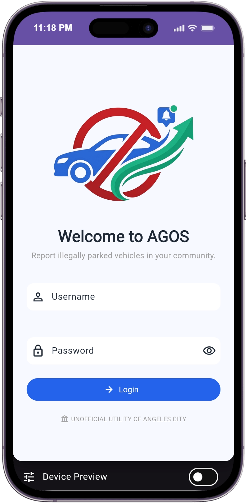
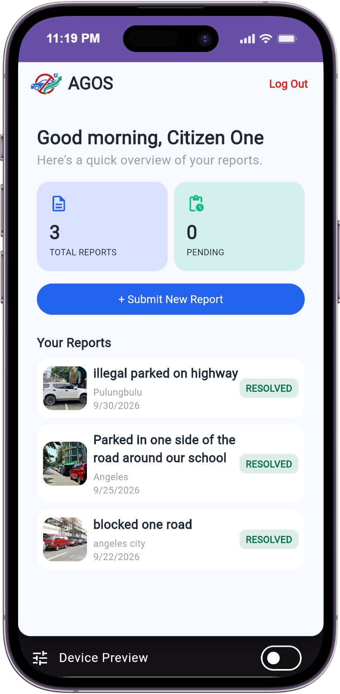
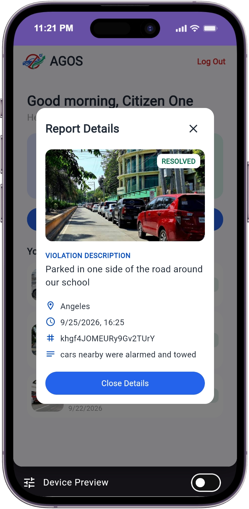
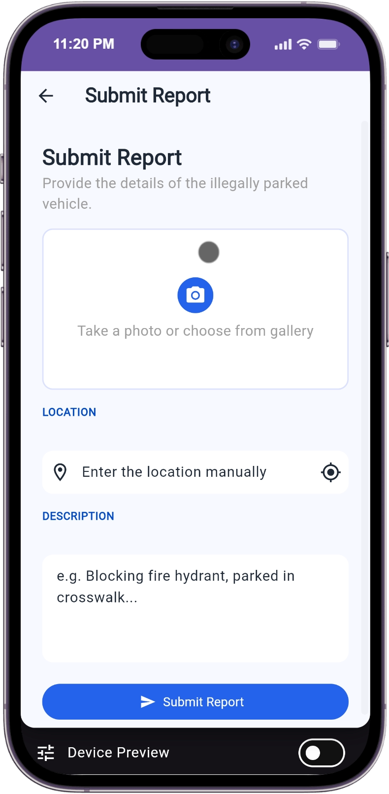
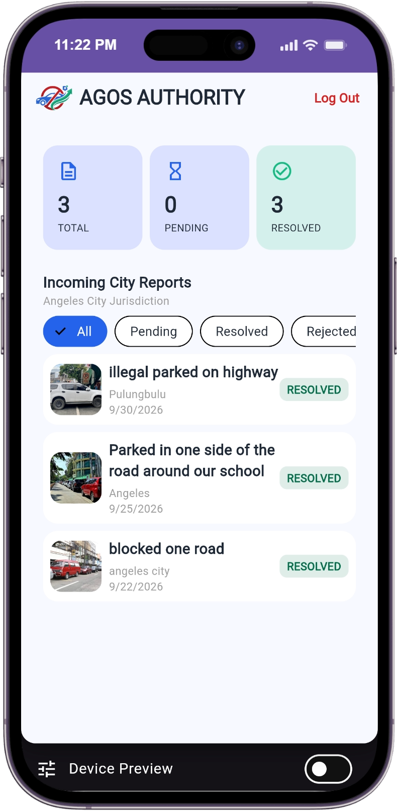
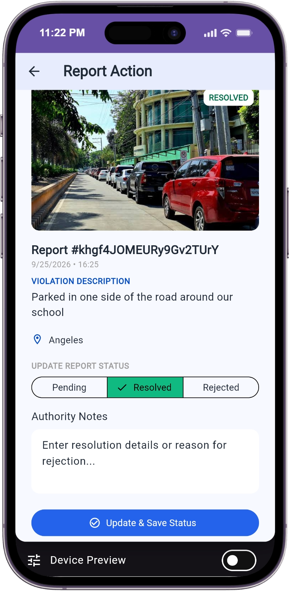

# AGOS

[](AI-USAGE.md)

*A mobile app for reporting illegally parked vehicles, built for citizens to report and local authorities to review and resolve.*

**Live demo:** [Open AGOS →](https://siyanfr.github.io/Agos-App-Finals/)

**Demo video:** [Watch the demo →](https://drive.google.com/file/d/1X8LlyfmZX_Bye2a_AhVtZTyae8NzjhdD/view?usp=drive_link) (see also [`docs/05-demo-video.md`](docs/05-demo-video.md) for timestamps)

**Presentation slides:** [View the slides →](https://drive.google.com/file/d/1J0NI0Yc84RKIR7LRcSbujvWXIT78xUdD/view?usp=sharing)

**Square image:** [View the square image →](https://drive.google.com/file/d/13p2zP-dpIyt_1Och6pu__8afJQpSXvlq/view?usp=sharing)

**Course:** Applications Development and Emerging Technologies (6ADET), Holy Angel University

**Author:** Cean Carosus

---

## Overview

AGOS is a mobile app for reporting illegally parked vehicles.
Citizens submit a report with a photo, a location, and a description;
authority reviewers see every incoming report, inspect the evidence, and mark
each one Resolved or Rejected. It's built for the two groups that currently
rely on informal Facebook pages for this, citizen reporters and local
government authority reviewers, giving both a structured, trackable
alternative.

## Screenshots

| Login | Citizen Dashboard | Report Details |
| --- | --- | --- |
|  |  |  |

| Submit Report | Authority Dashboard | Report Action |
| --- | --- | --- |
|  |  |  |

## What it does

- Citizens submit a report of an illegally parked vehicle with a photo, an auto-detected (or manually typed) location, and a description.
- GPS coordinates are reverse-geocoded into a readable address instead of raw numbers.
- Citizens track their own reports' status live, Pending, Resolved, or Rejected, with no refresh needed.
- Authority accounts see every incoming report city-wide, filterable by status, and can resolve or reject each one with notes.
- A status update by an authority account syncs live to the citizen's dashboard, since both read from the same Firestore collection.

## Built with

| | |
| --- | --- |
| Framework | Flutter (Dart SDK `^3.8.0`) |
| State | `setState`, plus Firestore `StreamBuilder`s for live data |
| Storage | Cloud Firestore (reports, users) + Cloudinary (report photos) |
| Other packages | `firebase_auth` — seeded-account sign-in; `image_picker` — photo capture/selection; `geolocator` — GPS auto-detect; `http` — Cloudinary upload and reverse-geocoding calls; `flutter_dotenv` — reads Cloudinary config from `.env`; `device_preview` — multi-device preview while developing |

## Project structure

```
lib/
  main.dart              # App entry point, dotenv + Firebase init, device_preview wrapper
  theme.dart             # AppColors, AppSpacing, AppRadius tokens + ThemeData
  firebase_options.dart  # Generated by FlutterFire CLI
  models/
    report_model.dart    # Report data class
  services/
    auth_service.dart       # Firebase Auth sign-in/out, fetches the user's role from Firestore
    firestore_service.dart  # Report reads/writes/status updates
    storage_service.dart    # Cloudinary photo upload
  screens/
    login_screen.dart
    citizen/
      citizen_dashboard_screen.dart
      submit_report_screen.dart
    authority/
      authority_dashboard_screen.dart
      report_action_screen.dart
  widgets/
    primary_button.dart
    text_input_field.dart
    status_badge.dart
    detail_row.dart
    report_card.dart
    image_upload.dart
    photo_evidence_viewer.dart
    stat_summary_card.dart
    navigation_header.dart
    detail_modal.dart
```

## Running it yourself

```bash
flutter pub get
cp .env.example .env      # fill in your own Cloudinary values, see below
flutter run -d chrome
```

(or target an Android/iOS device or emulator instead of `chrome`). Requires
Flutter with Dart SDK `^3.8.0` (run `flutter --version` to check yours).

You'll also need your own Firebase project connected via
`flutterfire configure` (generates `lib/firebase_options.dart`), with
Email/Password Authentication enabled and a `users` collection seeding at
least one account's `email`, `fullName`, and `role` fields. See
[`docs/06-security-and-privacy.md`](docs/06-security-and-privacy.md) for the
full Firestore security rules.

There's no self-registration by design; log in with one of these pre-seeded
demo accounts to actually see the app's data:

| Role | Email |
| --- | --- |
| Citizen | citizen1@agos.app |
| Citizen | citizen2@agos.app |
| Authority | authority1@agos.app |

**Password (all 3 accounts):** `agos2026`

This is a shared demo password for a class project with invented seed data,
not a real-world credential. Set your own if you're seeding a fresh Firebase
project of your own — see
[`docs/06-security-and-privacy.md`](docs/06-security-and-privacy.md).

### Environment variables

This project reads its configuration from a `.env` file that is **not** in the
repository. Copy `.env.example`, fill in your own values, and never commit the
result.

| Variable | What it is | Where to get one |
| --- | --- | --- |
| `CLOUDINARY_CLOUD_NAME` | Your Cloudinary account's cloud name | Cloudinary dashboard, after creating a free account |
| `CLOUDINARY_UPLOAD_PRESET` | An unsigned upload preset name | Cloudinary dashboard → Settings → Upload → Upload presets (Signing Mode: Unsigned) |

## Privacy and secrets

AGOS stores report data (photo, description, location, timestamp, status) and
basic user profile data (email, name, role) in Cloud Firestore; report photos
are hosted on Cloudinary. Secrets live in a gitignored `.env` locally, and as
repository secrets in the GitHub Actions deploy workflow; the data itself is
protected by Firestore security rules (a citizen can only read/write their own
reports, only an authority account can change a status), not by hiding any
config value. All sample accounts, reports, and the demo video use invented
data, no real personal information. Full details, including the published
rules and the full checklist, are in
[`docs/06-security-and-privacy.md`](docs/06-security-and-privacy.md) and
[`docs/SECURITY-CHECKLIST.md`](docs/SECURITY-CHECKLIST.md).

## Project documentation

| Document | |
| --- | --- |
| [Proposal](docs/01-proposal.md) | the problem, the users, the scope |
| [Mockup and wireframes](docs/02-mockup.md) | what it looks like, and the screen flow |
| [Design system](docs/03-design-system.md) | colors, type, spacing, components |
| [Weekly reports](docs/04-weekly-reports.md) | what happened each week |
| [Demo video](docs/05-demo-video.md) | the recording and what it shows |
| [Security and privacy](docs/06-security-and-privacy.md) | what the app stores and how it's protected |
| [Security checklist](docs/SECURITY-CHECKLIST.md) | the full Yes/No/N/A checklist, filled in |

## Status and what is next

**Working end to end:** login routed by role, citizen report submission with
photo and location, authority review and resolution, and live status sync
between the two roles, tested on both the Android emulator and Chrome.

**Known issues:**
- The Firestore `status` field isn't restricted to an enum at the rules
  level, only authority accounts can write to it at all, but nothing stops a
  malformed value in theory.
- Cloudinary photo uploads use an unsigned preset, standard for client-side
  uploads, but it means anyone who extracted the cloud name and preset could
  technically upload through it. Accepted as reasonable for a class project.
- The Firebase API key isn't restricted in the Google Cloud console,
  deliberate, since access is enforced by Firestore rules instead.

**What's next:**
- Push notifications, so citizens know the moment their report's status
  changes.
- Self-registration, instead of only the seeded demo accounts.
- AI-powered image detection, to automatically flag illegally parked vehicles
  in a submitted photo.

## Credits

- Packages: see [`pubspec.yaml`](pubspec.yaml)
- Everything else: built for AGOS, no third-party assets reused

## AI use


This project was built with heavy assistance from Claude (Anthropic),
covering most of the Flutter/Firebase implementation, debugging, and
documentation. Full details, including what was done independently, are in
[AI-USAGE.md](AI-USAGE.md).

## Licence

MIT, see [LICENSE](LICENSE).
