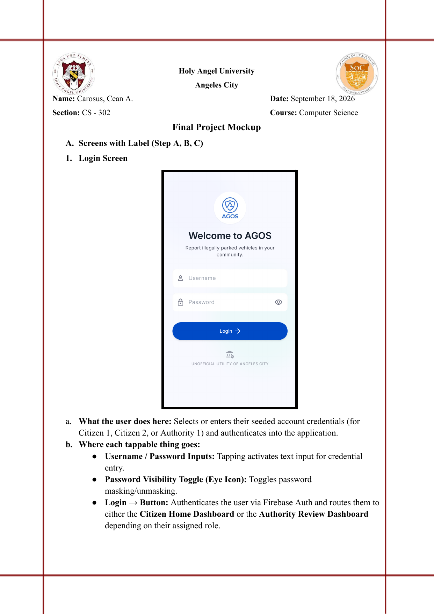
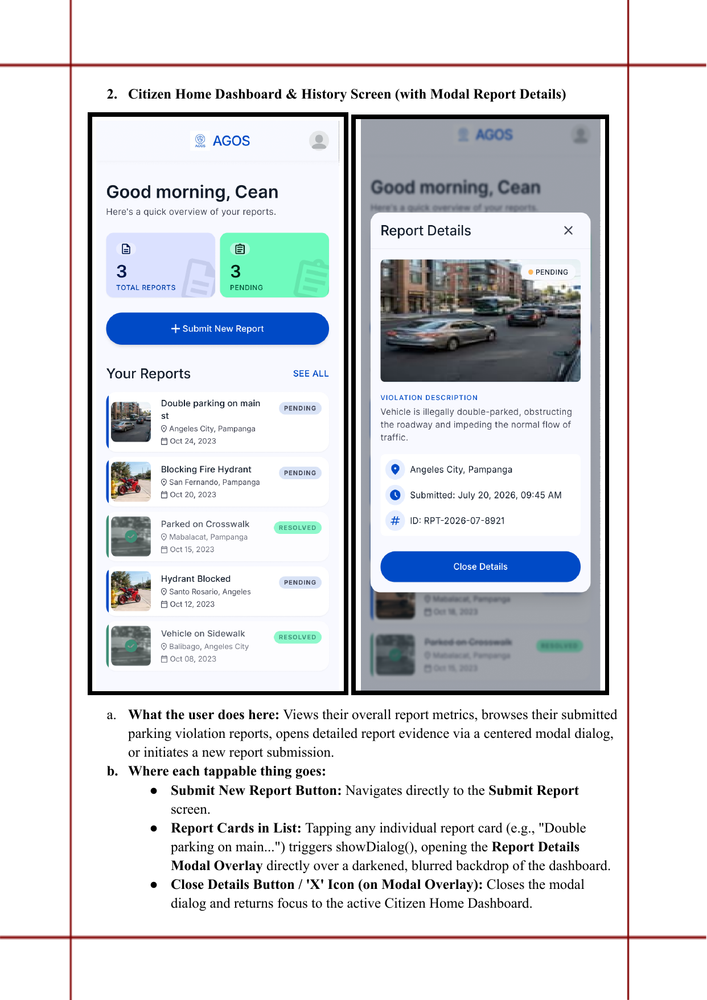
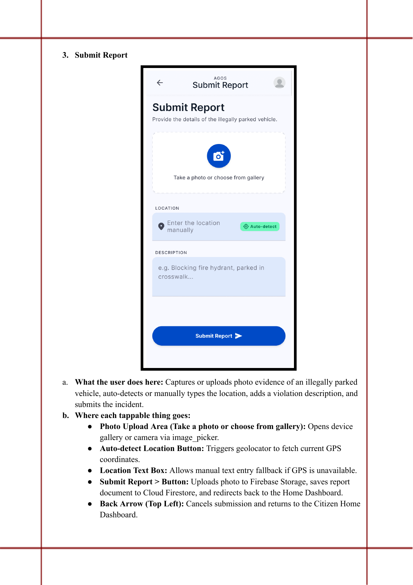
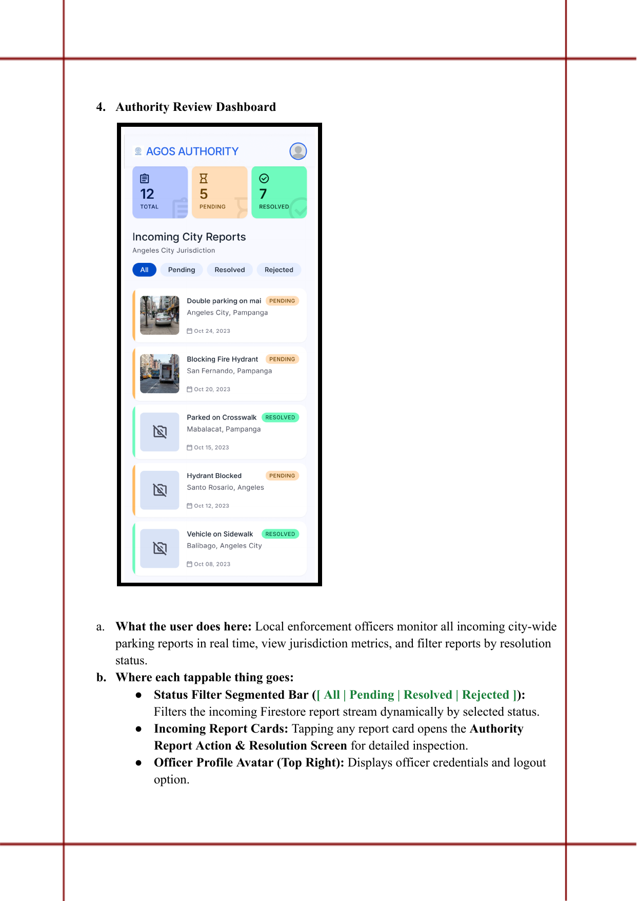
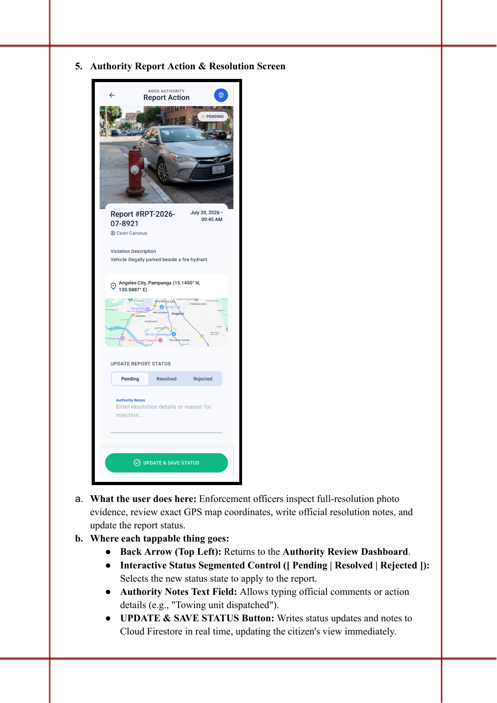
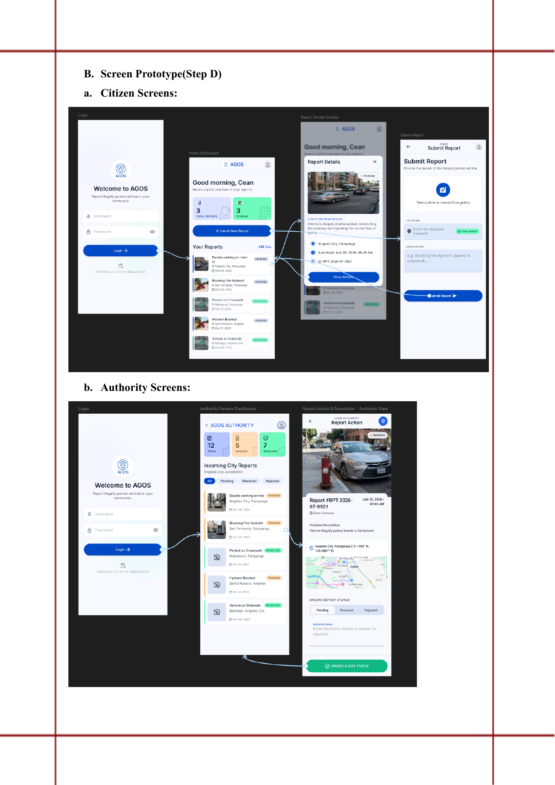
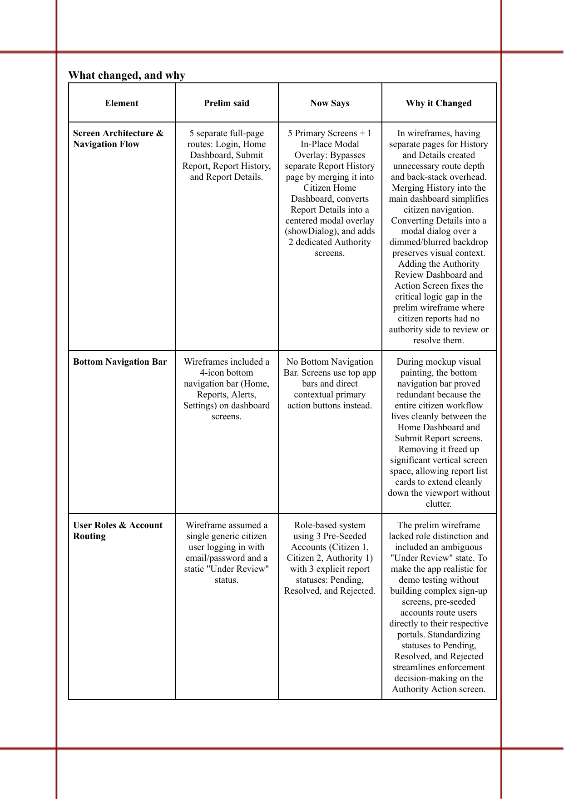

# Mockup and wireframes

> Final Project Mockup — submitted September 18, 2026 (CS-302).

## Mockup

### 1. Login Screen

Selects or enters seeded account credentials (Citizen 1, Citizen 2, or
Authority 1) and authenticates into the app.

### 2. Citizen Home Dashboard & History Screen (with Modal Report Details)

Views overall report metrics (total / pending), browses submitted reports,
opens full report evidence via a centered modal dialog, or starts a new
report.

### 3. Submit Report

Captures or uploads photo evidence, auto-detects or manually types a
location, adds a description, and submits.

### 4. Authority Review Dashboard

Local enforcement monitors all incoming city-wide reports in real time, views
jurisdiction metrics (total / pending / resolved), and filters by status.

### 5. Authority Report Action & Resolution Screen

Enforcement officers inspect full-resolution photo evidence, review GPS map
coordinates, write resolution notes, and update the report status.

## Wireframes

The screen flow, showing which screen opens first and how a user moves
between them for each role:

**Citizen flow:** Login → Citizen Home Dashboard → (tap a report) → Report
Details modal overlay, or → Submit Report → back to Dashboard.

**Authority flow:** Login → Authority Review Dashboard → (tap a report) →
Authority Report Action & Resolution Screen.

There's no bottom navigation bar — early wireframes had a 4-icon bottom nav
(Home, Reports, Alerts, Settings), but it proved redundant once the whole
citizen workflow was shown to live cleanly between the Home Dashboard and
Submit Report screens. Removing it freed vertical space for the report list.

## Screens

| Screen | Where each tappable thing goes |
|---|---|
| **Login** | Username/Password inputs activate text entry. Eye icon toggles password masking. **Login →** authenticates via Firebase Auth and routes to Citizen Home Dashboard or Authority Review Dashboard depending on role. |
| **Citizen Home Dashboard** | **+ Submit New Report** navigates to Submit Report. Tapping a report card triggers `showDialog()`, opening the Report Details modal over a darkened, blurred backdrop. **Close Details / X** closes the modal and returns to the dashboard. |
| **Submit Report** | Photo upload area opens gallery/camera via `image_picker`. **Auto-detect** triggers `geolocator` for GPS. The location text box is a manual fallback if GPS is unavailable. **Submit Report ➤** uploads the photo to Firebase Storage, saves the report to Firestore, and redirects to the Home Dashboard. Back arrow cancels and returns to the dashboard. |
| **Authority Review Dashboard** | Status filter bar (All / Pending / Resolved / Rejected) filters the incoming Firestore report stream live. Tapping a report card opens the Authority Report Action & Resolution screen. Officer avatar (top right) shows credentials and logout. |
| **Authority Report Action & Resolution** | Back arrow returns to the Authority Review Dashboard. The status segmented control (Pending/Resolved/Rejected) selects the new status. Authority Notes field allows resolution comments. **Update & Save Status** writes the status and notes to Firestore in real time, updating the citizen's view immediately. |
