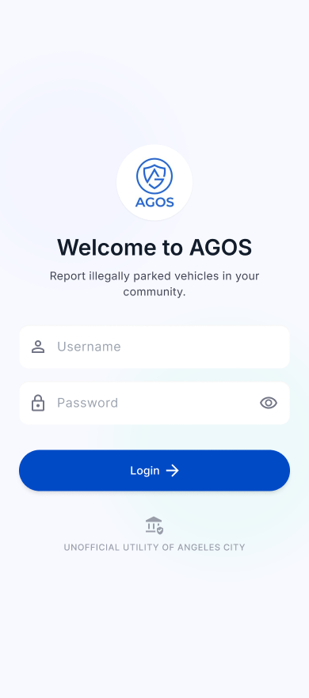
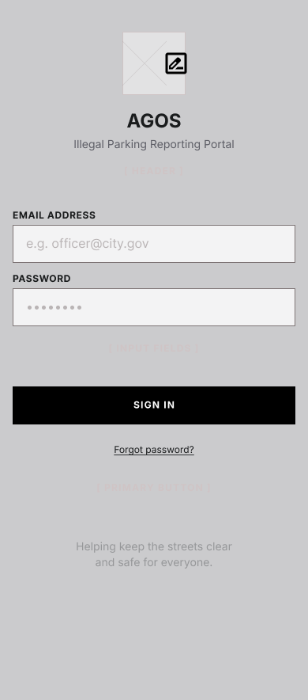

# Mockup and wireframes

## Mockup

### 1. Login Screen

**What the user does here:** Selects or enters their seeded account credentials (for Citizen 1, Citizen 2, or Authority 1) and authenticates into the application.

**Where each tappable thing goes:**

- **Username / Password Inputs:** Tapping activates text input for credential entry.
- **Password Visibility Toggle (Eye Icon):** Toggles password masking/unmasking.
- **Login → Button:** Authenticates the user via Firebase Auth and routes them to either the Citizen Home Dashboard or the Authority Review Dashboard depending on their assigned role.

---

### 2. Citizen Home Dashboard & History Screen (with Modal Report Details)

 

**What the user does here:** Views their overall report metrics, browses their submitted parking violation reports, opens detailed report evidence via a centered modal dialog, or initiates a new report submission.

**Where each tappable thing goes:**

- **Submit New Report Button:** Navigates directly to the Submit Report screen.
- **Report Cards in List:** Tapping any individual report card (e.g., "Double parking on main...") triggers `showDialog()`, opening the Report Details Modal Overlay directly over a darkened, blurred backdrop of the dashboard.
- **Close Details Button / 'X' Icon (on Modal Overlay):** Closes the modal dialog and returns focus to the active Citizen Home Dashboard.

---

### 3. Submit Report

**What the user does here:** Captures or uploads photo evidence of an illegally parked vehicle, auto-detects or manually types the location, adds a violation description, and submits the incident.

**Where each tappable thing goes:**

- **Photo Upload Area (Take a photo or choose from gallery):** Opens device gallery or camera via `image_picker`.
- **Auto-detect Location Button:** Triggers `geolocator` to fetch current GPS coordinates.
- **Location Text Box:** Allows manual text entry fallback if GPS is unavailable.
- **Submit Report > Button:** Uploads photo to Firebase Storage, saves report document to Cloud Firestore, and redirects back to the Home Dashboard.
- **Back Arrow (Top Left):** Cancels submission and returns to the Citizen Home Dashboard.

---

### 4. Authority Review Dashboard

**What the user does here:** Local enforcement officers monitor all incoming city-wide parking reports in real time, view jurisdiction metrics, and filter reports by resolution status.

**Where each tappable thing goes:**

- **Status Filter Segmented Bar (\[ All \| Pending \| Resolved \| Rejected \]):** Filters the incoming Firestore report stream dynamically by selected status.
- **Incoming Report Cards:** Tapping any report card opens the Authority Report Action & Resolution Screen for detailed inspection.
- **Officer Profile Avatar (Top Right):** Displays officer credentials and logout option.

---

### 5. Authority Report Action & Resolution Screen

**What the user does here:** Enforcement officers inspect full-resolution photo evidence, review exact GPS map coordinates, write official resolution notes, and update the report status.

**Where each tappable thing goes:**

- **Back Arrow (Top Left):** Returns to the Authority Review Dashboard.
- **Interactive Status Segmented Control (\[ Pending \| Resolved \| Rejected \]):** Selects the new status state to apply to the report.
- **Authority Notes Text Field:** Allows typing official comments or action details (e.g., "Towing unit dispatched").
- **UPDATE & SAVE STATUS Button:** Writes status updates and notes to Cloud Firestore in real time, updating the citizen's view immediately.

---

## Wireframes

### 1. Login

| Screen | Layout Notes | Inputs | Actions → Destination | Data Shown |
|--------|--------------|--------|-----------------------|------------|
| Login | Displays the AGOS logo at the top, followed by email and password input fields, and a Sign In button at the bottom. | Email, Password | Sign In → Home Dashboard | User credentials |

---

### 2. Home Dashboard

| Screen | Layout Notes | Inputs | Actions → Destination | Data Shown |
|--------|--------------|--------|-----------------------|------------|
| Home Dashboard | Displays the app header, New Report and History buttons, and a Recent Reports section showing previously submitted reports. | None | New Report → SubmitReport History → Report History Tap Recent Report → Report Details | User information, Recent Reports |

---

### 3. Submit Report

| Screen | Layout Notes | Inputs | Actions → Destination | Data Shown |
|--------|--------------|--------|-----------------------|------------|
| Submit Report | Contains buttons to Upload Photo and Select Location, a text area for the report description, and a Submit button. | Photo upload, GPS location, Report description | Upload Photo → Opens device gallery/camera Select Location → Opens location picker or GPS Submit → Report Details | Report information (photo, location, description) |

---

### 4. Report History

| Screen | Layout Notes | Inputs | Actions → Destination | Data Shown |
|--------|--------------|--------|-----------------------|------------|
| Report History | Displays a list of all reports previously submitted by the user along with their current status (e.g., Pending, Resolved). | None | Tap Report → Report Details Back → Home Dashboard | List of Reports, Report Status |

---

### 5. Report Details

| Screen | Layout Notes | Inputs | Actions → Destination | Data Shown |
|--------|--------------|--------|-----------------------|------------|
| Report Details | Displays the selected report, including the uploaded photo and description of the incident. | None | Back → Home Dashboard or Report History | Report Photo, Description, Location, Date Submitted, Report Status |

## Screens

### 1. Login Screen

**What is on it:**
- AGOS logo
- username field
- password field
- password visibility toggle
- Login action
- "Unofficial Utility of Angeles City" footnote

**What the user does:**

The user enters their seeded account's credentials and signs in. There is no Sign Up option; AGOS only supports pre-seeded citizen and authority accounts.

**Where each action goes:**

| Action | Result |
| --- | --- |
| Username / Password inputs | Activates text entry |
| Password visibility toggle | Toggles password masking |
| Login | Citizen Home Dashboard (citizen account) or Authority Review Dashboard (authority account) |

The screen routes to a different dashboard depending on the signed-in account's role rather than offering a role picker.

### 2. Citizen Home Dashboard (with Modal Report Details)

**What is on it:**
- AGOS app bar with brand icon and Log Out action
- greeting header ("Good morning, [name]")
- Total Reports / Pending StatSummaryCards
- Submit New Report action
- Your Reports list of ReportCards, each with a status badge
- Report Details modal overlay

**What the user does:**

The user checks their overall report metrics, browses their own submitted reports, opens a report's full evidence through a centered modal, or starts a new report submission.

**Where each action goes:**

| Action | Result |
| --- | --- |
| Log Out | Login Screen |
| Submit New Report | Submit Report |
| ReportCard | Opens the Report Details modal over a darkened backdrop |
| Close Details / X icon | Closes the modal, returns to the active Citizen Home Dashboard |

Unlike a list/map toggle, this screen has a single presentation; report details open in-place as a modal rather than a separate screen, to avoid extra navigation depth.

### 3. Submit Report

**What is on it:**
- back arrow
- "Submit Report" header
- photo upload area (take a photo or choose from gallery)
- location field with an auto-detect action
- description field
- Submit Report action

**What the user does:**

The user attaches a photo, auto-detects their GPS location or types it manually, writes a description of the violation, and submits.

Auto-detected coordinates are reverse-geocoded into a readable address (e.g. "Angeles City, Pampanga") rather than shown as raw numbers. Manual text entry remains available when location services are off or permission is denied, so the reporting flow can still complete.

**Where each action goes:**

| Action | Result |
| --- | --- |
| Back arrow | Citizen Home Dashboard — changes discarded |
| Photo upload area | Opens the device gallery via `image_picker` |
| Auto-detect location | Fetches GPS coordinates and resolves them to a place name |
| Submit Report | Citizen Home Dashboard — report saved with status "Pending" |

### 4. Authority Review Dashboard

**What is on it:**
- "AGOS AUTHORITY" app bar with Log Out action
- Total / Pending / Resolved StatSummaryCards
- status filter bar (All / Pending / Resolved / Rejected)
- Incoming City Reports list of ReportCards

**What the user does:**

The authority account monitors all incoming reports across the city, filters them by status, and selects one for inspection.

**Where each action goes:**

| Action | Result |
| --- | --- |
| Log Out | Login Screen |
| Status filter | Changes which reports are listed; does not change the stat cards above it |
| ReportCard | Authority Report Action & Resolution Screen |

### 5. Authority Report Action & Resolution

**What is on it:**
- back arrow
- full-width photo evidence
- report ID and timestamp
- violation description
- location
- status selector (Pending / Resolved / Rejected)
- Authority Notes field
- Update & Save Status action

**What the user does:**

The authority inspects the photo evidence and description, optionally writes resolution notes, and updates the report's status.

**Where each action goes:**

| Action | Result |
| --- | --- |
| Back arrow | Authority Review Dashboard |
| Status selector | Selects the new status to apply |
| Update & Save Status | Authority Review Dashboard — status (and notes) saved to Firestore |

A status update here reflects live on the citizen's dashboard without the citizen needing to refresh, since both screens read from the same Firestore `reports` collection.

### Complete navigation summary

| From | Tappable element | Leads to / Result |
| --- | --- | --- |
| Login Screen | Login | Citizen Home Dashboard or Authority Review Dashboard, by role |
| Citizen Home Dashboard | Log Out | Login Screen |
| Citizen Home Dashboard | Submit New Report | Submit Report |
| Citizen Home Dashboard | ReportCard | Report Details modal (same screen) |
| Report Details modal | Close Details / X | Citizen Home Dashboard |
| Submit Report | Back arrow | Citizen Home Dashboard — changes discarded |
| Submit Report | Auto-detect location | Resolves GPS to a readable address |
| Submit Report | Submit Report | Citizen Home Dashboard — report saved |
| Authority Review Dashboard | Log Out | Login Screen |
| Authority Review Dashboard | Status filter | Changes Authority Review Dashboard list only |
| Authority Review Dashboard | ReportCard | Authority Report Action & Resolution |
| Authority Report Action & Resolution | Back arrow | Authority Review Dashboard |
| Authority Report Action & Resolution | Update & Save Status | Authority Review Dashboard — status saved, synced live to citizen |

